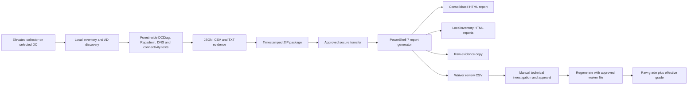

# Active Directory Health Assessment and Reporting Toolkit

A two-stage PowerShell toolkit for collecting point-in-time Active Directory health, inventory, DNS, replication, connectivity, time, SYSVOL, and event evidence, then converting that retained evidence into consolidated browser-readable HTML reports.

The toolkit separates **privileged evidence collection** from **offline report generation and governance**:

- **Collection stage:** Runs from an elevated Windows PowerShell console on a selected domain controller and creates a timestamped raw ZIP package.
- **Transfer stage:** Moves the ZIP package through an approved secure transfer path.
- **Reporting stage:** Runs in PowerShell 7 on an administrative workstation or management server and produces the consolidated forest report, local inventory reports, raw-evidence copies, and a waiver-review CSV.
- **Review stage:** Allows authorized administrators to investigate Red and Yellow findings, document approved exceptions, retain the original grade, and calculate an effective post-waiver grade.

The reporting workstation does not require domain credentials or a live management path to the domain controllers. The generator works from the retained collector ZIP package and can be rerun without recollecting data.

## Current Components

| File | Purpose |
|---|---|
| `Active Directory Health Report Collector Rev 1.5.ps1` | Collects local and forest-wide AD evidence, per-DC DNS and connectivity diagnostics, forward and return-path port tests, DNS-zone inventory, time evidence, DCDiag, Repadmin, DFSR, events, and local server inventory. |
| `Active Directory Health Report Generator Rev 2.3.ps1` | Imports one or more ZIP packages, evaluates health, applies approved waivers, and generates consolidated and local-inventory HTML reports. |
| `README.md` | Architecture, quick start, parameters, evidence, grading, waiver workflow, and repository overview. |
| `Wiki.md` | Detailed operational runbook, report interpretation, manual validation, waiver governance, port policy, and troubleshooting. |

Use the exact filenames present in the repository. If a later release changes a revision suffix, substitute the newer filename in the examples.

## Architecture



## Supported Operating Model

### Collector host

- Run from an elevated Windows PowerShell console on a selected writable domain controller.
- Windows Server 2012 or later; Windows PowerShell 5.1 is preferred.
- Active Directory PowerShell module, DCDiag, Repadmin, DNS tools, and related administration tools should be available.
- An account with approved AD and local administrative rights is required.
- Internet access is not required when the Windows component store contains the required management payload.
- A single selected collector can gather domain-wide directory, DNS, Repadmin, DCDiag, connectivity, return-path, and topology evidence.
- Run locally on additional DCs when complete local service, software, event, network, and configuration inventory is required for every DC.

### Reporting host

- PowerShell 7 or later.
- No domain membership requirement.
- No domain credentials required.
- No direct network path to domain controllers required.
- Sufficient storage to extract packages and preserve report output.

## Quick Start

### 1. Run the collector

Open **Windows PowerShell as Administrator**:

```powershell
Set-ExecutionPolicy -Scope Process -ExecutionPolicy Bypass -Force

& '.\Active Directory Health Report Collector Rev 1.5.ps1' `
    -OutputDirectory 'C:\AD-Health-Exports' `
    -TcpTimeoutMilliseconds 3000
```

Example package:

```text
C:\AD-Health-Exports\AD-Health-Raw-DC01-20260812-101500.zip
```

For the first full health collection, do not use `-SkipComprehensiveDcdiag` or `-SkipRemotePerspective` unless the corresponding tests are intentionally excluded.

### 2. Transfer the ZIP package

Copy the ZIP package to an approved directory on the PowerShell 7 reporting host, for example:

```text
C:\AD-Raw
```

### 3. Generate the initial report and waiver-review file

```powershell
Set-ExecutionPolicy -Scope Process -ExecutionPolicy Bypass -Force

& '.\Active Directory Health Report Generator Rev 2.3.ps1' `
    -InputPath 'C:\AD-Raw' `
    -OutputDirectory 'C:\AD-Health-Report'
```

Open:

```text
C:\AD-Health-Report\Active-Directory-Consolidated-Report.html
```

The generator also creates:

```text
C:\AD-Health-Report\AD-Health-Waiver-Review.csv
```

### 4. Regenerate with an approved waiver file

Keep the authoritative approved waiver file outside the generated report directory:

```text
C:\AD-Waivers\Approved-Waivers.csv
```

Then run:

```powershell
& '.\Active Directory Health Report Generator Rev 2.3.ps1' `
    -InputPath 'C:\AD-Raw' `
    -OutputDirectory 'C:\AD-Health-Report-Approved' `
    -WaiverPath 'C:\AD-Waivers\Approved-Waivers.csv'
```

## Collector Parameters

### Default collection

```powershell
& '.\Active Directory Health Report Collector Rev 1.5.ps1'
```

### Custom output directory

```powershell
& '.\Active Directory Health Report Collector Rev 1.5.ps1' `
    -OutputDirectory 'D:\AD-Health-Exports'
```

### Event-log lookback

```powershell
& '.\Active Directory Health Report Collector Rev 1.5.ps1' `
    -EventLookbackDays 14
```

### Increase network timeout for remote or Azure sites

```powershell
& '.\Active Directory Health Report Collector Rev 1.5.ps1' `
    -TcpTimeoutMilliseconds 3000
```

### Skip enterprise comprehensive DCDiag

```powershell
& '.\Active Directory Health Report Collector Rev 1.5.ps1' `
    -SkipComprehensiveDcdiag
```

### Skip reverse-path tests that use WinRM

```powershell
& '.\Active Directory Health Report Collector Rev 1.5.ps1' `
    -SkipRemotePerspective
```

### Keep the uncompressed working directory

```powershell
& '.\Active Directory Health Report Collector Rev 1.5.ps1' `
    -KeepWorkingDirectory
```

## Generator Parameters

### Process one ZIP

```powershell
& '.\Active Directory Health Report Generator Rev 2.3.ps1' `
    -InputPath 'C:\AD-Raw\AD-Health-Raw-DC01-20260812-101500.zip'
```

### Process all ZIP packages in a directory

```powershell
& '.\Active Directory Health Report Generator Rev 2.3.ps1' `
    -InputPath 'C:\AD-Raw' `
    -OutputDirectory 'C:\AD-Health-Report'
```

### Apply an approved waiver file

```powershell
& '.\Active Directory Health Report Generator Rev 2.3.ps1' `
    -InputPath 'C:\AD-Raw' `
    -OutputDirectory 'C:\AD-Health-Report-Approved' `
    -WaiverPath 'C:\AD-Waivers\Approved-Waivers.csv'
```

## Collected Evidence

The collector includes, when available:

- Forest and domain names and current functional levels
- Domain controllers, addresses, sites, OS versions, Global Catalog state, RODC state, enabled state, and reachability
- FSMO role holders
- Local Windows roles, features, services, applications, network configuration, and shares
- SYSVOL and NETLOGON publication and paths
- DFSRMIG global and migration state
- Windows Time status, source, configuration, peers, stratum, last sync, and forest monitor evidence
- Directory Service, DNS Server, DFS Replication, and System events
- `repadmin /showrepl * /csv`
- Per-DC targeted Repadmin output
- `repadmin /replsummary`
- `repadmin /queue *`
- Local verbose DCDiag
- Enterprise comprehensive DCDiag
- Per-DC DCDiag connectivity tests
- Per-DC DNS-specific DCDiag
- DNS-zone inventory
- Forward forest connectivity tests
- Return-path connectivity tests when remote PowerShell is available
- Collector log and manifest

## Connectivity Port Policy

The report distinguishes required, recommended, and conditional ports. Only failed required ports directly lower the connectivity grade.

| Protocol | Port | Service | Classification | Grade impact |
|---|---:|---|---|---|
| TCP/UDP | 53 | DNS | Required | Yes |
| TCP/UDP | 88 | Kerberos | Required | Yes |
| TCP | 135 | RPC Endpoint Mapper | Required | Yes |
| TCP/UDP | 389 | LDAP | Required | Yes |
| TCP | 445 | SMB and SYSVOL | Required | Yes |
| TCP | 49152-65535 | Dynamic RPC | Required | Validated through DCDiag, Repadmin, DFSR, and RPC functionality rather than scanning every port |
| TCP/UDP | 464 | Kerberos password change | Recommended | No |
| TCP | 636 | LDAPS | Conditional | No, unless required by design |
| TCP | 3268 | Global Catalog | Conditional | No, unless required by design |
| TCP | 3269 | Global Catalog over TLS | Conditional | No, unless required by design |
| TCP | 9389 | AD Web Services | Conditional | No, unless required by design |

A failed WinRM reverse-path test is reported as **Not Tested**, not as proof that AD ports are closed.

## Health and Grade Model

| State | Grade | Meaning |
|---|---:|---|
| Green | A | No unwaived Red or Yellow findings remain in the supplied evidence. Normal backups, approvals, and change controls still apply. |
| Yellow | C | One or more unwaived review conditions, optional-service findings, warnings, or evidence gaps remain. |
| Red | F | One or more unwaived blocking or high-risk findings remain. |

The report preserves two results when waivers are used:

- **Raw health and grade:** Original result before waivers.
- **Effective health and grade:** Result after valid, approved, unexpired waivers.

## Diagnostic Category Counts

The **Health by Diagnostic Category** section preserves the original distribution and the effective post-waiver result:

- `Green`
- `OriginalYellow`
- `WaivedYellow`
- `RemainingYellow`
- `OriginalRed`
- `WaivedRed`
- `RemainingRed`
- `EffectiveHealth`

The counts reconcile as follows:

```text
OriginalYellow = WaivedYellow + RemainingYellow
OriginalRed = WaivedRed + RemainingRed
```

Green findings are positive controls. Green findings never lower the grade and are excluded from waiver review.

## Waiver Governance

`AD-Health-Waiver-Review.csv` contains only Yellow and Red findings eligible for review. Each finding has a stable `FindingId` based on its scope, category, state, title, detail, and source.

A waiver is applied only when:

- `Approved` is `True`, `Yes`, `Y`, `1`, or `Approved`.
- `Approver` is populated.
- `ApprovedDate` is valid.
- `Reason` is populated.
- `ExpirationDate`, if supplied, is valid and not expired.

Recommended fields:

```text
Approved=True
Approver=<authorized reviewer>
ApprovedDate=2026-08-12
ExpirationDate=2027-08-12
Reason=<investigation and acceptance rationale>
TicketOrChange=<incident, risk, or change record>
```

Waivers do not remove evidence. The report retains the original finding and displays approved waivers separately. Expired or invalid waivers are not applied.

Store approved waivers separately from generated output so the generator does not overwrite the authoritative file:

```text
C:\AD-Waivers\Approved-Waivers.csv
```

## Functional-Level Readiness

The report evaluates Windows Server 2016 and Windows Server 2025 separately:

- **Windows Server 2016** is treated as the active customer target when applicable and can affect change readiness.
- **Windows Server 2025** is presented as future-readiness information and does not lower the grade for a Windows Server 2016 project.

OS eligibility does not replace operational validation. DNS, replication, SYSVOL, authentication, time, and change controls must still be reviewed.

## Report Contents

The consolidated HTML includes:

- Effective and raw forest grades
- Approved waiver count
- Forest and domain health assessment
- Health by diagnostic category
- Positive health controls
- Why This Grade
- Approved waivers
- Change recommendations
- DC reachability and coverage
- DNS server and zone inventory
- DNS diagnostic issues
- Windows Server 2016 and 2025 functional-level readiness
- Domain controller and GC inventory
- FSMO role holders
- Windows Server 2016 change blockers
- Validation gaps
- Red and Yellow findings
- Connectivity policy, summaries, and detailed forward and return-path tests
- Time synchronization information
- Collected package details

## Output Structure

```text
AD-Health-Report\
|-- Active-Directory-Consolidated-Report.html
|-- AD-Health-Waiver-Review.csv
|-- LocalInventory\
|   |-- DC01.html
|   `-- DC02.html
`-- Raw\
    |-- DC01\
    |   |-- collector.log
    |   |-- dcdiag-local-verbose.txt
    |   |-- dcdiag-enterprise-comprehensive-verbose.txt
    |   |-- repadmin-showrepl-all.csv.txt
    |   |-- forest-connectivity.json
    |   |-- forest-return-path.json
    |   |-- dns-zones.json
    |   `-- additional evidence
    `-- DC02\
        `-- additional evidence
```

`LocalInventory` contains local collector-package inventory reports. It is not intended to imply that every discovered DC has a local package.

## Security and Data Handling

The raw ZIP packages and generated reports may contain sensitive infrastructure information, including hostnames, IP addresses, AD topology, FSMO holders, service identities, software lists, network configuration, event messages, certificate information, and diagnostic output.

- Store artifacts in an approved restricted repository.
- Use approved encrypted transfer methods.
- Limit access to authorized infrastructure, security, audit, and change personnel.
- Retain raw evidence when provenance is required.
- Treat approved waiver files as change or risk records.
- Sanitize production examples before public distribution.
- Never publish production ZIP packages or reports to a public repository.

## Troubleshooting

### The report still shows F after approving a waiver

Verify the generator is reading the same CSV that was edited. The `-WaiverPath` input should not point to an older copy while the generator writes a refreshed CSV to the output directory.

```powershell
Import-Csv 'C:\AD-Waivers\Approved-Waivers.csv' |
    Where-Object {
        $_.OriginalState -eq 'Red' -and
        $_.Approved -notmatch '^(?i:true|yes|y|1|approved)$'
    }
```

Any returned rows remain Red and continue to produce an effective Grade F.

### Green findings appear in waiver review

Use Generator Rev 2.2 or later. Green findings are positive controls and are excluded from waiver review.

### Connectivity tables are empty

Use Generator Rev 1.8 or later. The generator loads `forest-connectivity.json` and falls back to `forest-connectivity.csv`, flattens return-path results, and ignores null records.

### Time information is missing

Use Generator Rev 2.0 or later. The generator supports both:

```text
w32tm-status-verbose.txt
w32tm-source.txt
w32tm-forest-monitor.txt
```

and:

```text
w32tm-status.txt
w32tm-configuration.txt
```

### DCDiag connectivity shows syntax error

The server argument must be a single argument without a space:

```powershell
dcdiag /test:Connectivity /s:DC01.contoso.com /v
```

### Delegation warnings appear for all DNS servers

Run the targeted delegation test, identify the exact delegated name, validate parent NS and glue records, confirm `_msdcs` and DC locator records, and only waive the warning when the approved DNS design does not use that delegation.

```powershell
dcdiag /test:DNS /DnsDelegation /v /s:DC01
```

### Enterprise DCDiag times out

Run comprehensive DCDiag per DC to isolate the slow target or test, then rerun the enterprise test. A timeout is a coverage gap, not automatically a failed test.

### Missing local collector coverage

A single package can provide substantial forest-wide evidence, but local services, software, event, and configuration inventory is complete only for DCs that produced local packages.

## Contributions

Contributions should:

- Preserve raw evidence and provenance.
- Keep collection and reporting separate.
- Retain PowerShell 5.1 compatibility for the collector where possible.
- Use PowerShell 7 for the generator.
- Avoid treating optional or conditional services as mandatory without design context.
- Preserve raw and effective grades when waivers are used.
- Never hide approved findings or remove their audit trail.
- Add new diagnostic rules conservatively and document grade impact.
