# Active Directory Health Assessment and Reporting Toolkit

A two-stage PowerShell toolkit for collecting point-in-time Active Directory health and inventory evidence from domain controllers and converting the retained evidence into a consolidated, browser-readable HTML assessment.

The toolkit intentionally separates **privileged collection** from **report generation**:

- **Collection stage**: runs locally on each domain controller using elevated Windows PowerShell and built-in Microsoft administration tools.
- **Transfer stage**: moves timestamped raw ZIP packages through an approved transfer path.
- **Reporting stage**: runs on a modern administrative workstation using PowerShell 7 and produces a consolidated forest/domain report, detailed per-DC reports, and preserved raw evidence.

This design avoids requiring WinRM, remote PowerShell, WMI/DCOM, administrative shares, or direct remote management access from the reporting workstation to the domain controllers.

## Repository Contents

| File | Purpose |
|---|---|
| `Active Directory Health Report Collector Rev 1.0.ps1` | Runs locally on a domain controller, gathers raw Active Directory and Windows Server evidence, and creates a timestamped ZIP package. |
| `Active Directory HealthReport Generator Rev 1.0.ps1` | Runs in PowerShell 7, imports one or more collector ZIP packages, evaluates health, and creates consolidated and per-DC HTML reports. |
| `README.md` | Repository overview, architecture, quick start, operational workflow, and command examples. |
| `Wiki-Home.md` | Detailed operational guide, evidence reference, health interpretation, security guidance, and troubleshooting. |

> Use the exact script filenames present in the repository. If a future release changes the revision suffix, substitute the newer filename in the examples.

## Why the Toolkit Uses Two Scripts

Domain controllers are frequently subject to restrictive security controls. Remote PowerShell, WinRM, AD Web Services, direct LDAP from workgroup systems, remote WMI, and administrative shares may be limited or prohibited. The collector therefore runs locally on each DC and uses the local security context of the administrator.

The report generator never needs domain credentials or network access to the domain controllers. It works entirely from the transferred ZIP packages, which allows reports to be regenerated without recollecting data.

## End-to-End Workflow

```mermaid
flowchart LR
    subgraph DC[Domain Controller]
        A[Administrator opens elevated Windows PowerShell] --> B[Run Collector Rev 1.0]
        B --> C[Check AD module, DCDiag, and Repadmin]
        C --> D[Install or import AD administration tools when required]
        D --> E[Collect forest, domain, DC, DNS, GC, FSMO, SYSVOL, DFSR, services, software, network, time, and event data]
        E --> F[Run DCDiag and Repadmin diagnostics]
        F --> G[Write JSON and raw TXT evidence]
        G --> H[Create timestamped ZIP]
    end

    subgraph Transfer[Approved Transfer]
        H --> I[Copy ZIP packages to reporting workstation]
    end

    subgraph Reporting[PowerShell 7 Reporting Workstation]
        I --> J[Place ZIPs in one input directory]
        J --> K[Run Generator Rev 1.0]
        K --> L[Validate package manifests]
        L --> M[Assess replication, DNS, DCDiag, SYSVOL, DFSR, events, functional levels, and reachability]
        M --> N[Assign Green, Yellow, or Red health and letter grade]
        N --> O[Generate consolidated HTML]
        N --> P[Generate one HTML report per collected DC]
        N --> Q[Preserve raw evidence by DC]
    end

    O --> R[Administrator review and change decision]
    P --> R
    Q --> R
```



## Supported Operating Model

### Collector host

- Run locally on a domain controller.
- Windows Server 2012 or later.
- Windows PowerShell 3.0 or later. Windows PowerShell 5.1 is preferred when available.
- Elevated administrative console.
- Account with sufficient Active Directory and local administrative rights. The intended operating model assumes Domain Admin or equivalent approved rights.
- No PowerShell 7 requirement.
- No user interface.
- No internet requirement when the RSAT/AD DS management payload exists in the local Windows component store.

### Reporting host

- Modern Windows administrative workstation or management server.
- PowerShell 7 or later.
- No domain membership requirement.
- No domain credentials required.
- No network path to domain controllers required.
- Sufficient disk space to extract all ZIP packages and retain the report output.

## Quick Start

### 1. Run the collector locally on every DC

Open **Windows PowerShell as Administrator**:

```powershell
Set-ExecutionPolicy -Scope Process -ExecutionPolicy Bypass -Force

& '.\Active Directory Health Report Collector Rev 1.0.ps1'
```

The default ZIP is written beneath:

```text
C:\AD-Health-Exports
```

Example output:

```text
C:\AD-Health-Exports\AD-Health-Raw-DC01-20260802-142029.zip
```

For complete per-DC services, roles, software, event, network, SYSVOL, and local diagnostic evidence, run the collector locally on every domain controller.

### 2. Transfer the ZIP packages

Copy all collector ZIP files to a controlled directory on the PowerShell 7 workstation, for example:

```text
C:\AD-Raw
```

### 3. Generate the HTML reports

Open PowerShell 7:

```powershell
Set-ExecutionPolicy -Scope Process -ExecutionPolicy Bypass -Force

& '.\Active Directory HealthReport Generator Rev 1.0.ps1' `
    -InputPath 'C:\AD-Raw' `
    -OutputDirectory 'C:\AD-Health-Report'
```

Open:

```text
C:\AD-Health-Report\Active-Directory-Consolidated-Report.html
```

## Collector Parameters

### Default collection

```powershell
& '.\Active Directory Health Report Collector Rev 1.0.ps1'
```

### Custom output directory

```powershell
& '.\Active Directory Health Report Collector Rev 1.0.ps1' `
    -OutputDirectory 'D:\AD-Health-Exports'
```

### Change event-log lookback

```powershell
& '.\Active Directory Health Report Collector Rev 1.0.ps1' `
    -EventLookbackDays 14
```

### Skip enterprise-wide comprehensive DCDiag

```powershell
& '.\Active Directory Health Report Collector Rev 1.0.ps1' `
    -SkipComprehensiveDcdiag
```

### Keep the uncompressed working directory

```powershell
& '.\Active Directory Health Report Collector Rev 1.0.ps1' `
    -KeepWorkingDirectory
```

## Generator Parameters

### Process one ZIP

```powershell
& '.\Active Directory HealthReport Generator Rev 1.0.ps1' `
    -InputPath 'C:\AD-Raw\AD-Health-Raw-DC01-20260802-142029.zip'
```

### Process every ZIP in a directory

```powershell
& '.\Active Directory HealthReport Generator Rev 1.0.ps1' `
    -InputPath 'C:\AD-Raw' `
    -OutputDirectory 'C:\AD-Health-Report'
```

## Collected Evidence

The collector includes, when available:

- Forest and domain names and functional levels
- Domain controllers, IP addresses, sites, OS versions, GC state, RODC state, enabled state, and reachability
- FSMO role holders
- Installed Windows roles and features
- Complete service inventory and state
- Installed application inventory
- Network adapters, IP configuration, gateways, DNS clients, and DHCP state
- SYSVOL and NETLOGON shares and paths
- DFSRMIG global and migration state
- Windows Time status and configuration
- Directory Service, DNS Server, DFS Replication, and System events
- `repadmin /showrepl /csv`
- `repadmin /replsummary`
- `repadmin /queue`
- Local verbose DCDiag
- Enterprise comprehensive verbose DCDiag
- DNS-specific DCDiag for discovered DCs
- Collector log and manifest

## Health Assessment

The report generator evaluates evidence and produces:

- Forest health grade
- Overall Green, Yellow, or Red state
- Replication health
- DNS health
- DCDiag health
- SYSVOL publication state
- NETLOGON publication state
- DFSR versus legacy FRS indication
- Critical and recurring event findings
- Domain controller availability and reachability
- DNS server count and inventory
- Forest and domain functional-level upgrade path
- Per-DC upgrade blockers
- Change recommendations for adding a DC, migrating FSMO roles, raising functional levels, and demoting a DC
- Red findings requiring action
- Yellow findings requiring review

## Health Color Model

| State | General meaning |
|---|---|
| Green | No detected blocking condition in the supplied evidence. Normal change controls and backups still apply. |
| Yellow | Review condition, incomplete evidence, or nonblocking warning. Administrator validation is required. |
| Red | Blocking or high-risk condition detected. Correct the issue before performing disruptive directory changes. |

Health grading is evidence based and reflects the packages supplied to the generator. Missing collector packages can reduce confidence and are called out as coverage warnings.

## Output Structure

```text
AD-Health-Report\
├── Active-Directory-Consolidated-Report.html
├── DomainControllers\
│   ├── DC01.html
│   └── DC02.html
└── Raw\
    ├── DC01\
    │   ├── collector.log
    │   ├── dcdiag-local-verbose.txt
    │   ├── dcdiag-enterprise-comprehensive-verbose.txt
    │   ├── repadmin-showrepl-all.csv.txt
    │   └── additional evidence
    └── DC02\
        └── additional evidence
```

## Security and Data Handling

The raw ZIP and generated reports can contain sensitive infrastructure information, including hostnames, IP addresses, AD topology, FSMO holders, service identities, installed software, network configuration, event messages, and diagnostic output.

- Store artifacts in an approved restricted location.
- Use approved encrypted transfer mechanisms.
- Limit access to authorized infrastructure, security, audit, and change personnel.
- Retain raw packages when evidence provenance is required.
- Sanitize all production examples before publishing publicly.
- Do not upload production ZIP packages or reports to a public GitHub repository.

## Troubleshooting

### Collector reports missing prerequisites

The collector attempts to install or import the AD PowerShell and AD DS administration tools. If the local component store cannot supply the payload, install **AD DS and AD LDS Tools** through Server Manager or the organization's approved offline servicing method.

### ServerManager feature inventory fails

The collector automatically falls back to DISM feature enumeration. A successful DISM fallback is acceptable and is recorded in the collector log.

### DFS Replication reports zero matching events

This means no Critical, Error, or Warning events matched the selected lookback period. It is not itself a failure.

### Repadmin files are small

Single-DC environments can produce small Repadmin outputs because no replication partners exist. Open the raw file to distinguish a valid no-partner result from an access or syntax error.

### Report shows missing DC coverage

Run the collector locally on every DC and place all ZIP packages in the generator input directory.

### Report grade is unexpectedly Red

Review the **Red Findings Requiring Action** section and the cited raw evidence file. Common causes include failed DCDiag tests, replication errors, DNS diagnostic failures, missing SYSVOL/NETLOGON, legacy or indeterminate SYSVOL replication, and recurring Critical/Error events.

## License and Contributions

Review `LICENSE` for licensing terms. Contributions should preserve the two-stage architecture, retain raw evidence, support legacy Windows PowerShell on the collector, and avoid introducing remote-management dependencies into the reporting workflow.

